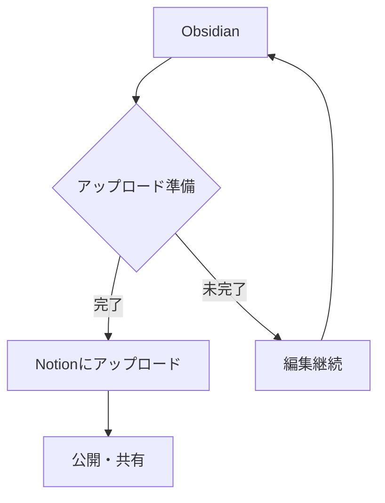

# Obsidian & Notion統合テストドキュメント

このドキュメントは、ObsidianからNotionへのアップロード機能をテストするための包括的なサンプルです。

## Obsidian固有機能のテスト

### 内部リンクとバックリンク
- [[量子コンピューティング基礎]] - 存在しないノートへのリンク
- [[# ヘッダーへのリンク]]
- [[202405281430-サンプルノート|エイリアス付きリンク]]

### タグシステム
#obsidian #notion #zettelkasten #markdown #テスト #日本語タグ

### 埋め込みとトランスクルージョン
![[埋め込みノート]]

### Obsidianのコールアウト
> [!NOTE] ノート
> これは重要な情報です。

> [!WARNING] 警告
> 注意が必要な内容です。

> [!TIP] ヒント
> 便利な情報をお伝えします。

> [!IMPORTANT] 重要
> 必須の情報です。

> [!CAUTION] 注意
> 慎重に扱ってください。

### 数式のテスト

インライン数式: $$E = mc^2$$

ブロック数式:
$$
\begin{align}
\nabla \times \vec{\mathbf{B}} -\, \frac1c\, \frac{\partial\vec{\mathbf{E}}}{\partial t} &= \frac{4\pi}{c}\vec{\mathbf{j}} \\   
\nabla \cdot \vec{\mathbf{E}} &= 4 \pi \rho \\
\nabla \times \vec{\mathbf{E}}\, +\, \frac1c\, \frac{\partial\vec{\mathbf{B}}}{\partial t} &= \vec{\mathbf{0}} \\
\nabla \cdot \vec{\mathbf{B}} &= 0
\end{align}
$$

LaTeXコードブロック:
```latex
\documentclass{article}
\begin{document}
\title{サンプル文書}
\author{著者名}
\maketitle
\section{序論}
これはLaTeXの例です。
\end{document}
```

### Mermaidダイアグラム




---

# 従来のMarkdown機能テスト

## Headers

### h3 ヘッダー
#### h4 ヘッダー
##### h5 ヘッダー
###### h6 ヘッダー

Alt-H1
======

Alt-H2
------

---

## 強調表現

Emphasis, aka italics, with *asterisks* or _underscores_.

Strong emphasis, aka bold, with **asterisks** or __underscores__.

Combined emphasis with **asterisks and _underscores_**.

Strikethrough uses two tildes. ~~Scratch this.~~

**This is bold text**
__This is bold text__
*This is italic text*
_This is italic text_
~~Strikethrough~~

---

## リスト

### 順序付きリスト
1. First ordered list item
2. Another item
3. Actual numbers don't matter, just that it's a number
4. And another item.

### ネストしたリスト
1. Make my changes
    1. Fix bug
    2. Improve formatting
        - Make the headings bigger
2. Push my commits to GitHub
3. Open a pull request
    * Describe my changes
    * Mention all the members of my team
        * Ask for feedback

### 順序なしリスト
* Unordered list can use asterisks
- Or minuses
+ Or pluses

+ Create a list by starting a line with `+`, `-`, or `*`
+ Sub-lists are made by indenting 2 spaces:
  - Marker character change forces new list start:
    * Ac tristique libero volutpat at
    + Facilisis in pretium nisl aliquet
    - Nulla volutpat aliquam velit
+ Very easy!

---

## タスクリスト

- [x] Finish my changes
- [ ] Push my commits to GitHub
- [ ] Open a pull request
- [x] @mentions, #refs, [links](), **formatting**, and <del>tags</del> supported
- [x] list syntax required (any unordered or ordered list supported)
- [x] this is a complete item
- [ ] this is an incomplete item

---

## リンク

### 通常のリンク
[I'm an inline-style link](https://www.google.com)
[I'm an inline-style link with title](https://www.google.com "Google's Homepage")

### 参考リンク
[I'm a reference-style link][Arbitrary case-insensitive reference text]
[You can use numbers for reference-style link definitions][1]
Or leave it empty and use the [link text itself].

### 自動リンク
URLs and URLs in angle brackets will automatically get turned into links.
http://www.example.com or <http://www.example.com>

### 日本語のリンク
[日本語リンクのテスト](https://www.google.co.jp)
[学術論文](https://arxiv.org/abs/2301.00001)
[技術ドキュメント](https://docs.python.org/ja/3/)

[arbitrary case-insensitive reference text]: https://www.mozilla.org
[1]: http://slashdot.org
[link text itself]: http://www.reddit.com

---

## 画像

### インライン画像


### 参照スタイル画像
![alt text][logo]

[logo]: https://github.com/adam-p/markdown-here/raw/master/src/common/images/icon48.png "Logo Title Text 2"

### GitHub画像


---

## コードとシンタックスハイライト

Inline `code` has `back-ticks around` it.

### JavaScript
```javascript
function $initHighlight(block, cls) {
  try {
    if (cls.search(/\bno\-highlight\b/) != -1)
      return process(block, true, 0x0F) +
             ` class="${cls}"`;
  } catch (e) {
    /* handle exception */
  }
  for (var i = 0 / 2; i < classes.length; i++) {
    if (checkCondition(classes[i]) === undefined)
      console.log('undefined');
  }
}

export $initHighlight;
```

### Python
```python
def upload_to_notion(file_path, database_id):
    """Notionにファイルをアップロードする関数"""
    try:
        with open(file_path, 'r', encoding='utf-8') as f:
            content = f.read()
        
        # ファイルを処理
        result = process_markdown(content)
        return result
    except Exception as e:
        logging.error(f"エラー: {e}")
        return None
```

### Shell
```bash
#!/bin/bash
# Obsidianからの一括アップロードスクリプト
for file in ~/Obsidian/vault/*.md; do
    python upload_to_notion.py "$file"
    echo "Uploaded: $file"
done
```

---

## テーブル

### 基本テーブル
| 機能 | Obsidian | Notion | 対応状況 |
|------|----------|--------|----------|
| 内部リンク | ✅ | ❌ | 🔄変換中 |
| タグ | ✅ | ✅ | ✅ |
| 数式 | ✅ | ✅ | ✅ |
| Mermaid | ✅ | ❌ | 🔄検討中 |

### アライメントテーブル
| Left-aligned | Center-aligned | Right-aligned |
| :---         |     :---:      |          ---: |
| git status   | git status     | git status    |
| git diff     | git diff       | git diff      |

### マークダウン入りテーブル
| Command | Description |
| --- | --- |
| `git status` | List all *new or modified* files |
| `git diff` | Show file differences that **haven't been** staged |

---

## 引用

> Blockquotes are very handy in email to emulate reply text.
> This line is part of the same quote.

Quote break.

> This is a very long line that will still be quoted properly when it wraps. Oh boy let's keep writing to make sure this is long enough to actually wrap for everyone. Oh, you can *put* **Markdown** into a blockquote.

### ネストした引用
> Blockquotes can also be nested...
>> ...by using additional greater-than signs right next to each other...
> > > ...or with spaces between arrows.

---

## 脚注

Footnote 1 link[^first].
Footnote 2 link[^second].
Inline footnote^[Text of inline footnote] definition.
Duplicated footnote reference[^second].

[^first]: Footnote **can have markup**
    and multiple paragraphs.

[^second]: Footnote text.

---

## 水平線

Three or more...

---

Hyphens

***

Asterisks

___

Underscores

---

## 特殊なケース

### エスケープ文字
Let's rename \*our-new-project\* to \*our-old-project\*.

### YouTube動画リンク
[](https://www.youtube.com/watch?v=QgbLb6QCK88)

### HTMLタグ
<dl>
  <dt>Definition list</dt>
  <dd>Is something people use sometimes.</dd>
  <dt>Markdown in HTML</dt>
  <dd>Does *not* work **very** well. Use HTML <em>tags</em>.</dd>
</dl>

---

## まとめ

このテストドキュメントは以下をカバーしています：

1. **Obsidian固有機能**
   - 内部リンク `[[]]`
   - タグ `#tag`
   - コールアウト
   - 埋め込み `![[]]`

2. **共通Markdown機能**
   - ヘッダー、強調、リスト
   - コード、テーブル、引用
   - 数式（LaTeX）
   - 画像、リンク

3. **拡張機能**
   - Mermaidダイアグラム
   - タスクリスト
   - 脚注

4. **日本語対応**
   - 日本語文字列
   - 日本語タグ
   - 日本語リンク

このファイルを使って、ObsidianからNotionへのアップロード機能を包括的にテストできます。